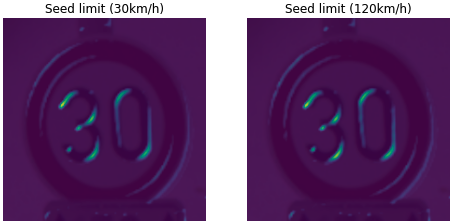

# Improving neural networks sturdiness through a data-augmentation generated by adversarial attacks

The purpose of this article is to analyze what adversarial attacks on neural networks are and whether networks can take advantage of these attacks to obtain more training data, increasing their predictions accuracy and robustness to future attacks. We will also found if one input generated by an attack on one network works on other similar networks.

To do so, more than 30 adversarial attacks had been generated and will be tasted against 3 different network architectures. On of the networks will be re trained with this attacks and finally tested to see if this attacks work as data augmentation and also if the network sturdiness increases.

What we will see is that one attack generated on a network A does not work on some other network B. This attack confuses network B and the prediction obtained is random but not determined. We will also see that adversarial attacks can be used as data augmentation strategies and that the networks are not fooled by the same kind of attacks after a re-train step. The last experiment will show us that there is no significant time increase in the execution of the attacks on a re-trained network.

> "Adversarial attacks are inputs to machine learning models that an attacker has intentionally designed to cause the model to make a mistake; they’re like optical illusions for machines."

  

  

Read the article in pdf.
